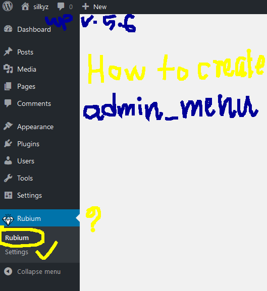

# WP Setting API <br>
 ## Summary index

1.[Administration Menus](#Administration-Menus)
   - [Every Plot Needs a Hook](#Every-Plot-Needs-a-Hook)
     - Second nested list item <br>

2.[Setting API](#Setting-API)
   - [Create a custom menu](#Create-a-custom-menu)
     - Second nested list item <br>

### Administration Menus

Usually, plugin and theme authors need to provide access to a settings (options) screen so users can customize how the plugin or theme is used. The best way to present the user with such a screen is to create an administration menu item that allows the user to access that settings screen from all the Administration Screens. 

<table>
<tr>
  <th>General Functions </th>
  <th>WordPress Administration Menus </th>
</tr>
<tr>
 <td>

 ```
   Menu Pages

    add_menu_page()
    add_object_page()
    add_utility_page()
    remove_menu_page()

SubMenu Pages

    add_submenu_page()
    remove_submenu_page()
```
</td>
<td>
 
```
    add_dashboard_page()
    add_posts_page()
    add_media_page()
    add_pages_page()
    add_comments_page()
    add_theme_page()
    add_plugins_page()
    add_users_page()
    add_management_page()
    add_options_page()
```
</td>
</tr>
</table>

## Every Plot Needs a Hook

To add an administration menu, you must do ***three things***:

  1.  Create a function that contains the menu-building code ( ***Hook callback*** )
  2. Register the above function using the admin_menu action hook. (If you are adding an admin menu for the Network, use network_admin_menu instead). ( ***Hook*** )
 3. Create the HTML output for the page (screen) displayed when the menu item is clicked. ( ***Hook derived Callback template or 2nd callback*** . e.g. in (hook) callbak we call WP api function which has also a callback)
	


### Setting API
The Settings API, added in WordPress 2.7, allows admin pages containing settings forms to be managed semi-automatically. It lets you define settings pages, sections within those pages and fields within the sections. <br><br>
New settings pages can be registered along with ***sections and fields*** inside them. Existing settings pages can also be added to by registering new settings sections or fields inside of them.

   <table>
<tr>
  <th> Function Reference </th>
  <th></th>
</tr>
<tr>
 <td>

 ```
  Setting Register/Unregister

    register_setting()
    unregister_setting()


Options Form Rendering

    settings_fields()
    do_settings_sections()
    do_settings_fields()

	

```
</td>
<td>
 
```
Add Field/Section

    add_settings_field()
    add_settings_section()

Errors

    add_settings_error()
    get_settings_errors()
    settings_errors()
```
</td>
</tr>
</table>

   - 


#### Visual description 1.0 image-1.00

## Create a custom menu 
-	I will create custom pages in adminbar in administration panel for general setting such as *input field* .
-	Newly generated admin menu is Rubium and icon seen left pic and a blank page right.
- This is called parent page and settings is sub page.
-	For icon [click here]( https://www.flaticon.com/free-icon/diamond_940926)

## WP Code drilling - 1.00  <br>
```PHP
// inc/function-admin.php
<?php     
class Robium_setup{

  public function __construct(){
       add_action('admin_menu', array($this,
         'rubium_add_admin_page'));
          }
  public function rubium_add_admin_page(){
      add_menu_page('rubium theme option','Rubium ' ,'manage_options' , 'abcd_rubium', 'robium_create_theme_page',  get_template_directory_uri().'/img/diamond.png',  110);
      add_submenu_page('abcd_rubium','Rubium settings','Settings','manage_options','abcd_rubium_settings', 'rubium_theme_settings_page');}
   }
   //callback
  function robium_create_theme_page(){
      //generation of admin page
  }
  function rubium_theme_settings_page(){
    //generation of admin sub page
   }

```
## WP Code drilling details - 1.00  <br>

- I will use separate file dir called 
   ***inc/function-admin.php*** , 
     use OOP and 
- In function.php file
 give file directory path,
 ```php
 require get_template_directory().'/inc/function-admin.php';
 ```
- add_action(‘admin_menu’,  array() ) is used in 
constructor.

## summary

<table>
<tr>
  <th> Three steps </th>
  <th></th>
</tr>
<tr>
 <td>

 ```
  Add admin menu

   1. action hook('admin_menu ', callback )
   2. callback(){
        register_setting(callback2)
   }
   


Options Form Rendering

    

	

```
</td>
<td>
 
```
Add Field/Section

    add_settings_field()
    add_settings_section()

Errors

    add_settings_error()
    get_settings_errors()
    settings_errors()
```
</td>
</tr>
</table>

