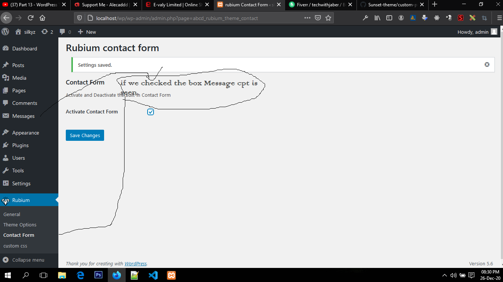
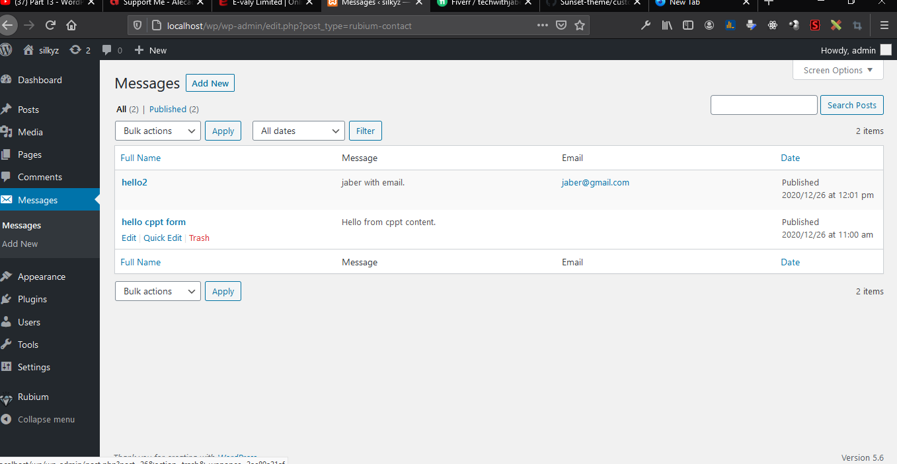
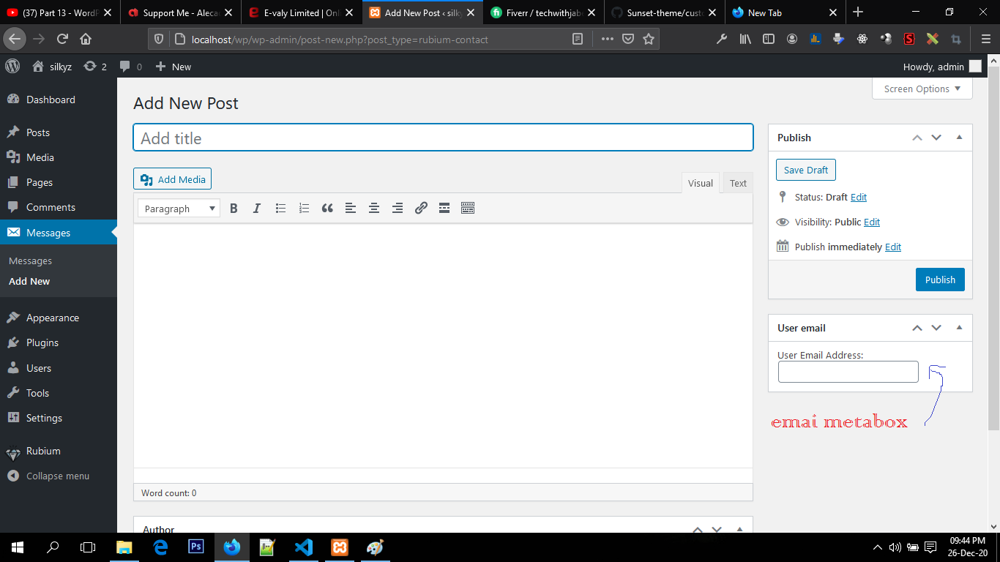

# contact form option and  custom post type<br>
 ## Summary index

1.[pre-talk](#Administration-Menus)
   - [contact form submenu](#contact-form-submenu)
     - [3 steps to make submenu](3-steps-to-make-submenu)
     - [Three steps to make submenu :1. Hook callback , 2. Hook , 3 . Hook Callback derived template function or 2nd callback](#Three-steps-to-make-submenu)<br>

2.[Adding Section and Field on sub page](#Adding-Section-and-Field-on-sub-page)
   - [Create a custom menu](#Create-a-custom-menu)
     <br>

3.[Adding Custom post type **Message**](#Adding-Custom-post-type)
   - [Create a custom menu and link up the option checkbox](#Create-a-custom-menu)
     <br>
# Contact form submenu
In this contact form subpage ,we can acivate or deactivate contact form for custom post type called message. see the below image - <br> <br>
 .
# 3 steps to make submenu:

To add an administration menu, you must do ***three things***:
  1.  Create a function that contains the menu-building code ( ***Hook callback*** )
  2. Register the above function using the admin_menu action hook. (If you are adding an admin menu for the Network, use network_admin_menu instead). ( ***Hook*** )
 3. Create the HTML output for the page (screen) displayed when the menu item is clicked. ( ***Hook derived Callback template or 2nd callback*** . e.g. in (hook) callbak we call WP api function which has also a callback)

## Three steps to make submenu: 

 1. Hook callback , <br>
 ```
 function rubium_add_admin_page(){
  /contact form
 add_submenu_page( 'abcd_rubium', 'rubium Contact Form', 'Contact Form', 'manage_options', 'abcd_rubium_theme_contact', 'rubium_contact_form_page' );
 }
 ```
 2. Hook , <br>
 ```add_action('admin_menu', 'rubium_add_admin_page');```
 3. Hook Callback derived template function or 2nd callback .
 ```
  //form 
     function rubium_contact_form_page(){
      require_once(get_template_directory().'/inc/templates/rubium-contact-form.php');
     }
  ```
  Excelent ! You successfully add a sub-page.

  ## Adding Section and Field on sub page
  For section and field in the page which live in the ```admin_init``` hook callback scope
  ( *callback* ) , two callbacks come out respectively ( *2nd callbacks*). From these two callbacks two ```slug``` arguments we match in template code as below  
  ```
  settings_fields('rubium-contact-options'); ?>
 <?php do_settings_sections('abcd_rubium_theme_contact');
 ```
  ## code
  step-1 **callback**
  ```
   function rubium_custom_settings(){
       register_setting( 'rubium-contact-options', 'activate_contact');
 
	
	add_settings_section( 'rubium-contact-section', 'Contact Form', 'rubium_contact_section', 'abcd_rubium_theme_contact');
	
	add_settings_field( 'activate-form', 'Activate Contact Form', 'rubium_activate_contact', 'abcd_rubium_theme_contact', 'rubium-contact-section' );
   }
  ```
  Step-2  **Hook**
  ```
   
 //activate custom settengs section
 add_action('admin_init','rubium_custom_settings');
  ```   
  step-3  **2nd callbacks**
  ```
//contact function 
  function rubium_contact_section() {
    echo 'Activate and Deactivate the Built-in Contact Form';
  }
  
  function rubium_activate_contact() {
    $options = get_option( 'activate_contact' );//note activate_contact should match with register_setting
    $checked = ( @$options == 1 ? 'checked' : '' );
    echo '<label><input type="checkbox" id="custom_header" name="activate_contact" value="1" '.$checked.' /></label>';
  }
  ```
# 3. Adding Custom post type and linking with option checkbox
we need to create a new file in inc folder called ```custom_post_type.php```. You know CPT is **CRUD** operation in last. To link we just
contionally call ```get_option('acivate_contact')``` function.

Here is code

```
$contact = get_option( 'activate_contact' );
if( @$contact == 1 ){ //@ indicate isset()
	add_action( 'init', 'rubium_contact_custom_post_type' );
	 //edit cppt field
	add_filter('manage_rubium-contact_posts_columns', 'rubium_set_contact_columns');
   
	add_action('manage_rubium-contact_posts_custom_column','rubium_contact_custom_column', 10, 2);
	add_action( 'add_meta_boxes', 'rubium_contact_add_meta_box' );
	add_action( 'save_post', 'rubium_save_contact_email_data' );
}
```
Here filter and action hook is worked for making
custom column and e-mail metabox
## the remaining code
```


/* CONTACT CPT */
function rubium_contact_custom_post_type() {
	$labels = array(
		'name' 				=> 'Messages',
		'singular_name' 	=> 'Message',
		'menu_name'			=> 'Messages',
		'name_admin_bar'	=> 'Message'
	);
	
	$args = array(
		'labels'			=> $labels,
		'show_ui'			=> true,
		'show_in_menu'		=> true,
		'capability_type'	=> 'post',
		'hierarchical'		=> false,
		'menu_position'		=> 26,
		'menu_icon'			=> 'dashicons-email-alt',
		'supports'			=> array( 'title', 'editor', 'author' )
	);
	
	register_post_type( 'rubium-contact', $args );
	
}
 function rubium_set_contact_columns($columns){
	$newColumns=array();
	$newColumns['title']  ='Full Name';
	$newColumns['message'] ='Message';
	$newColumns['email']   ='Email';
	$newColumns['date']    ='Date';
return $newColumns;	
}

function rubium_contact_custom_column($column,$post_id){
	
	switch($column){
		case 'message': 
			echo get_the_excerpt();
			break;
			case 'email' : 
				//email column
				$email = get_post_meta( $post_id, '_contact_email_value_key', true );
				echo '<a href="mailto:'.$email.'">'.$email.'</a>';
				break;
	}
}

/** contact meta box */

function rubium_contact_add_meta_box(){
    add_meta_box('contact_email', 'User email', 'rubium_contact_email_callback', 'rubium-contact', 'side');
  }


function rubium_contact_email_callback( $post ) {
	wp_nonce_field( 'rubium_save_contact_email_data', 'rubium_contact_email_meta_box_nonce' );
	
	$value = get_post_meta( $post->ID, '_contact_email_value_key', true );
	
	echo '<label for="rubium_contact_email_field">User Email Address: </lable>';
	echo '<input type="email" id="rubium_contact_email_field" name="rubium_contact_email_field" value="' . esc_attr( $value ) . '" size="25" />';
}

function rubium_save_contact_email_data($post_id){
      if(!isset($_POST['rubium_contact_email_meta_box_nonce'])){
		  return;
	  }
	  if(! wp_verify_nonce($_POST['rubium_contact_email_meta_box_nonce'],'rubium_save_contact_email_data')){
    return;
	  }
	  if( defined('DOING_AUTOSAVE') && DOING_AUTOSAVE ){
		return;
	}
	
	if( ! current_user_can( 'edit_post', $post_id ) ) {
		return;
	}
	
	if( ! isset( $_POST['rubium_contact_email_field'] ) ) {
		return;
	}
	$my_data=sanitize_text_field($_POST['rubium_contact_email_field']);
	update_post_meta( $post_id, '_contact_email_value_key', $my_data );

}


```
CPT Page message


email-metabox

