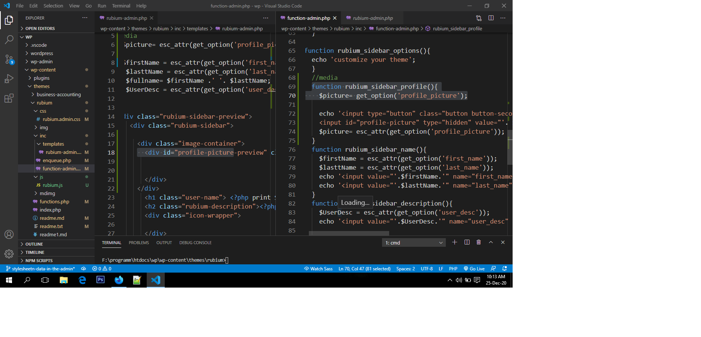

# How to to Add a Custom Media Uploader Button in WordPress Admin<br>
 ## Summary index

1.[1. Upload Button HTML](#1.-Upload-Button-HTML)
   - [2. JavaScript part](#2.-JavaScript-part)
     - [3. Enqueue scripts into admin area using ```wp_enqueue_script()``` and ``` wp_enqueue_media()```](#Enqueue-scripts-into-admin-area)<br>


### Pretalk
When you create some sort of [meta boxes](https://rudrastyh.com/wordpress/meta-boxes.html) or maybe a custom options page, sometimes you need fields like an image upload button or a file uploader.<br><br>
there are 3 easy steps how to create an uploader button on your own.
# 1. Upload Button HTML

Our Html template file **templates/rubium-admin.php** is linked up or inluded in **inc/function-admin.php**(media input field is in it.) file which also linked up with **functions.php** file.<br> <br>


```
function rubium_custom_settings(){
    //section creation 1st step
     register_setting('rubium-settings-group','profile_picture');
      register_setting('rubium-settings-group','first_name');
      register_setting('rubium-settings-group','last_name');
      register_setting('rubium-settings-group','user_desc');
      register_setting('rubium-settings-group','twitter_handler','sanitize_twitter_handler');
      register_setting('rubium-settings-group','fb_handler');
      register_setting('rubium-settings-group','gg_handler');
    //section creation 2nd step
      add_settings_section('rubium-sidebar-options','sidebar options','rubium_sidebar_options','abcd_rubium' );
     //media
      add_settings_field('sidebar-profile','Profile picture','rubium_sidebar_profile','abcd_rubium','rubium-sidebar-options');

      add_settings_field('sidebar-name','Full Name','rubium_sidebar_name','abcd_rubium','rubium-sidebar-options');
      add_settings_field('sidebar-description','User description','rubium_sidebar_description','abcd_rubium','rubium-sidebar-options');
      add_settings_field('sidebar-twitter','Twitter handler','rubium_sidebar_twitter','abcd_rubium','rubium-sidebar-options');
      add_settings_field('sidebar-google','Google handler','rubium_sidebar_google','abcd_rubium','rubium-sidebar-options');
      add_settings_field('sidebar-facebook','Facebook handler','rubium_sidebar_facebook','abcd_rubium','rubium-sidebar-options');
    }

  function rubium_sidebar_options(){
    echo 'customize your theme';
    }
    //media
    function rubium_sidebar_profile(){
      $picture= get_option('profile_picture');

      echo '<input type="button" class="button button-secondary" value="upload profile picture" id="upload-button">
      <input id="profile-picture" type="hidden" value="'. $picture.'" name="profile_picture" placeholder="Picture upload">';
      $picture= esc_attr(get_option('profile_picture'));
    } 
```
To retrieve data into template file
```
<?php 
//media
   $picture= esc_attr(get_option('profile_picture'));
   ...

?>
 <div class="image-container">
         <div id="profile-picture-preview" class="profile-picture" style=" background-image:url(<?php echo $picture; ?>); ">
    
          
         </div>
       </div>
       ...
       
```
# 2. JavaScript part

Remember that you should register js in **enqueue.php** file
```
jQuery(document).ready( function($){
   var mediaUploader;
   $('#upload-button').click(function(e){
    e.preventDefault();
    if(mediaUploader){
        mediaUploader.open();
        return;
    }

   mediaUploader = wp.media.frames.file_frame = wp.media({
         title: "Choose a profile picture",
         button:
         {
             text: "Choose picture"
         },
         multiple:false,
   });
   mediaUploader.on('select',function(){
   attachment=mediaUploader.state().get('selection').first().toJSON();
   $('#profile-picture').val(attachment.url);
   //to directly show on preview
   $('#profile-picture-preview').css('background-image','url('+ attachment.url +')');
   });

   mediaUploader.open();
   });
});

```
 look this line ```attachment=mediaUploader.state().get('selection').first().toJSON();``` we got json data which we can use in php code : **templates/rubium-admin.php** is linked up or inluded in **inc/function-admin.php**.
 this line ```$('#profile-picture-preview').css('background-image','url('+ attachment.url +')');```
 dictact that when we upload image through our custom button ,we  immediately render in preview section. look into **templates/rubium-admin.php** file ,there is a class called ```profile-picture-preview``` .
 # Enqueue scripts into admin area
 in ```inc/enqueue.php``` file 

 ```
 function rubium_load_admin_scripts($hook){
    if('toplevel_page_abcd_rubium' != $hook){
  
           return ;
    }
    ...
   // loading js
   wp_register_script( 'ru-some-js', get_template_directory_uri().'/js/rubium.js', array('jquery'), '1.0.0', true );
   wp_enqueue_script( 'ru-some-js' );
   wp_enqueue_media();
}

 add_action('admin_enqueue_scripts','rubium_load_admin_scripts') ;


 ```


 