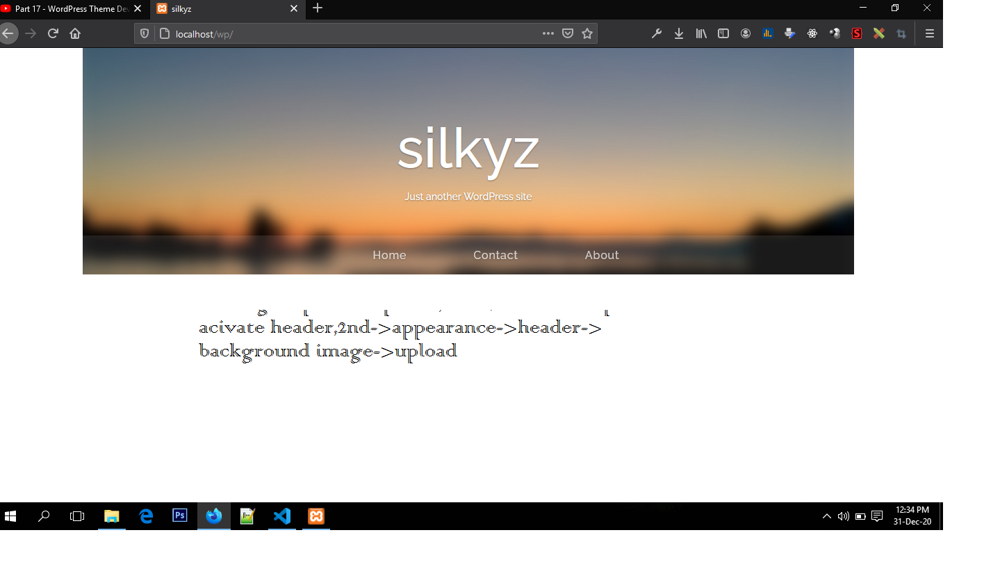

# WP Front end <br>
 ## Summary index

1.[file structure](#header.php-footer.php)
   - [ index.php , header.php , footer.php](#needed-files)
     - [Enqueuing css and js](#needed-files) <br>

2.[Create header section frontend](#Create-header-section)
   - [Create a custom menu](#Create-a-custom-menu)
     - Second nested list item

3.[How to use sass](#How-to-use-sass)
   - [Create a custom menu](#Create-a-custom-menu)
     - Second nested list item<br>

4.[Create custom nav menu](#Create-custom-nav-menu)
   - [Create a custom menu](#Create-a-custom-menu)
     - Second nested list item<br>

# 1. file structure 
Basic files,we need to create int theme folder ```rubium```
```index.php``` ```header.php``` and ```footer.php```
In *index.php* 
we call header and footer file by 

```
<?php get_header(); ?>

<?php get_footer(); ?>
```
In header.php file

```
<?php
/**
 * The header for our theme
 *
 * This is the template that displays all of the <head> section and everything up until <div id="content">
 *
 * @link https://developer.wordpress.org/themes/basics/template-files/#template-partials
 *
 * @package rubium
 * theme
 */

?>
<!DOCTYPE html>
<html <?php language_attributes(); ?>>
	<head>
      <title><?php bloginfo( 'name' ); wp_title(); ? ></title>
		<meta charset="<?php bloginfo( 'charset' ); ?>">
		<meta name="description" content="<?php bloginfo( 'description' ); ?>">
       <meta name="viewport" content="width=device-width, initial-scale=1">
		 <link rel="profile" href="http://gmpg.org/xfn/11">
		 <?php if( is_singular() && pings_open( get_queried_object() ) ): ?>
			<link rel="pingback" href="<?php bloginfo( 'pingback_url' ); ?>">
		 <?php endif; ?>
         //
		 <?php wp_head(); ?>
	</head>

<body <?php body_class(); ?>>
<div class="container">
   <div class="row">
       <div class="col-xl-12">
          
       <!-- col-xl-12 -->
    </div>
     <!-- .row -->
</div>
<!-- .container-fluid -->  
```
```wp_head();``` and ```wp_footer()``` is link up to functions.php ***enqueue css and js file*** which we discuss below. <br><br>
In footer.php file
```
<?php wp_footer(); ?>    
</body>
</html>
```
## Enqueuing css and js 
We can enqueue css and js in  function.php file either directly in the file or separatelly the other muduled file which includes in functions.php file. In our case we use ```inc/enqueue.php``` file as below-
```
/*
	
	========================
		FRONT-END ENQUEUE FUNCTIONS
	========================
*/

function rubium_load_scripts(){
	
	wp_enqueue_style( 'bootstrap', get_template_directory_uri() . '/css/bootstrap.min.css', array(), '3.3.6', 'all' );
	wp_enqueue_style( 'rubium', get_template_directory_uri() . '/css/rubium.css', array(), '1.0.0', 'all' );
	wp_enqueue_style( 'rateway', 'https://fonts.googleapis.com/css2?family=Raleway:wght@200;300;500&display=swap');
	wp_deregister_script( 'jquery' );
	wp_register_script( 'jquery' , get_template_directory_uri() . '/js/jquery.js', false, '1.11.3', true );
	wp_enqueue_script( 'jquery' );
	wp_enqueue_script( 'bootstrap', get_template_directory_uri() . '/js/bootstrap.min.js', array('jquery'), '3.3.6', true );
	
}
add_action( 'wp_enqueue_scripts', 'rubium_load_scripts' );
```
# 2. Create header section frontend
Look the image


We should upload this image by wp admin panel under ```appearance->header->background image```
then to show in frontend write the following code in **header.php**
```
<div class="row">
       <div class="col-xl-12">
           <div class="header-container background-image text-center" style="background-image:url(<?php header_image()?>)">
```
We can style the header image ```div``` using css class.
# 3.How to use sass
We can use sass extension in vs code ***Live Sass Compiler by
ritwickdey live-sass
Ritwick Dey*** <br> <br>
Now create ```sass folder and css folder``` 
in css folder make a file 
named ```rubium.css``` (or style.css etc)<br> <br>
write the folowing command
in ```rubium``` directory (theme's root directory)
```
sass --watch scss:css
//to compressed it
sass --watch scss:css --style compressed
```


# 4. Create custom nav menu

register menu item in functions.php
```

add_theme_support( 'post-formats', array( 'aside', 'chat', 'gallery', 'image', 'link', 'quote', 'status', 'video', 'audio' ) );


register_nav_menus( array(
    'menu-1' => esc_html__( 'Primary', 'theme-textdomain' ),
) );
```
download ```bootstrap-navwalker.php``` file <be>
Then 
write the following code in template header.php file

<div class="container">
   <div class="row">
       <div class="col-xl-12">
           <div class="header-container background-image text-center" style="background-image:url(<?php header_image()?>)">
             <div class="header-content table">
               <div class="table-cell">
                 <h1 class = "site-title">
                    <span class="sunset-logo"></span>
								    <span class="hide"><?php bloginfo( 'name' ); ?></span>
                  </h1>
                  <h2 class="site-description"><?php bloginfo('description');?></h2>
                </div>
             </div> <!-- .header-content -->
             <div class="rubium-nav">
             <nav class="navbar navbar-expand-lg navbar-light ">
                      <!-- <button class="navbar-toggler" type="button" data-toggle="collapse" data-target="#navbar-content" aria-controls="navbar-content" aria-expanded="false" aria-label="<?php esc_html_e( 'Toggle Navigation', 'theme-textdomain' ); ?>">
                        <span class="navbar-toggler-icon"></span>
                      </button> -->

                <div class="collapse navbar-collapse rubium-nav-inner " id="navbar-content">
                  <?php
                  wp_nav_menu( array(
                    'theme_location' => 'menu-1',
                    'menu_id'        => 'primary-menu',
                    'container'      => false,
                    'depth'          => 2,
                    'menu_class'     => 'navbar-nav ml-auto',
                    'walker'         => new Bootstrap_NavWalker(),
                    'fallback_cb'    => 'Bootstrap_NavWalker::fallback',
                  ) );
                  ?>
                </div>
                </nav>
             </div>
          
            </div>
           <!-- .container-header -->
       </div> 
       <!-- col-xl-12 -->
    </div>
     <!-- .row -->
</div>
<!-- .container-fluid -->

# Excelent reading *thanks*
